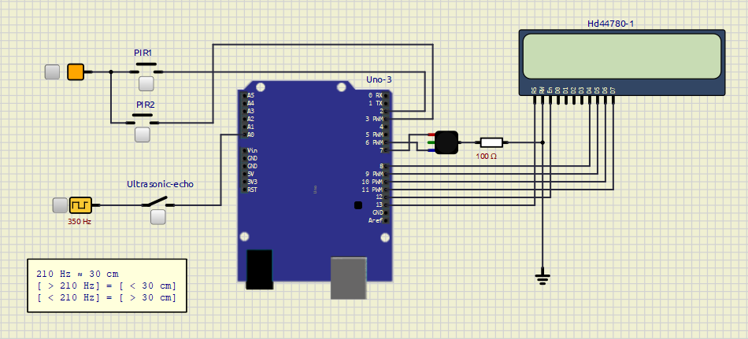
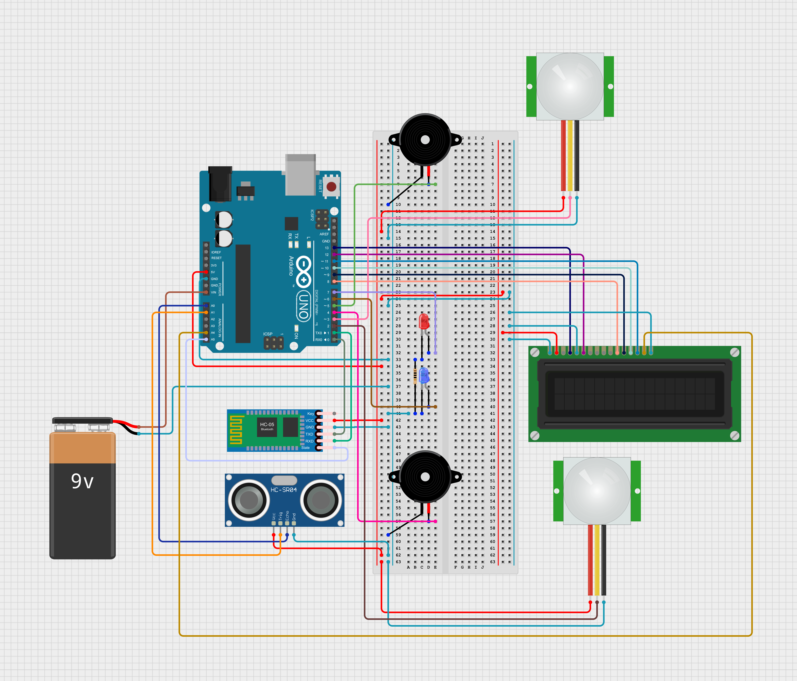

# Remote Cabin Security System

## Introduction
This project involves developing a low-power, reliable security system for remote cabins. It detects intrusions and notifies users through buzzers and LEDs, while maintaining efficient operation under limited power conditions. The system is designed with fault tolerance, energy-efficient operation, and secure Bluetooth communication, making it compatible with remote and standalone environments.

---

## Features
- **Intruder Detection**: Uses PIR and ultrasonic sensors to detect and confirm motion.
- **User Alerts**: Notifies users through buzzers and LEDs.
- **LCD Display**: Displays system status and intrusion count.
- **Bluetooth Communication**: Provides remote access with XOR encryption for secure data transfer.
- **Power Efficiency**: Operates on a 9V battery with power-saving sleep modes to extend battery life.

---

## Components
1. **Arduino UNO** – Central microcontroller.
2. **PIR Sensors (HC-SR505)** – Detect motion via infrared.
3. **Ultrasonic Sensor** – Confirms presence by measuring distance.
4. **16x2 LCD** – Displays system information.
5. **Bluetooth Module (HC-05)** – Enables wireless communication.
6. **Buzzers & LEDs** – Provide alerts.
7. **9V Battery** – Powers the system.

---

## Simulation
SimulIDE lacks ultrasonic sensor support, so a square wave generator was used to simulate distance sensing by adjusting pulse width.

---

## How to Use
1. **Assemble** the circuit as shown in the circuit diagram.
2. **Upload** the code to the Arduino UNO.
3. **Power On** with a 9V battery.
4. **Monitor** system status on the LCD or via Bluetooth.

---

## Circuit Diagram

---
